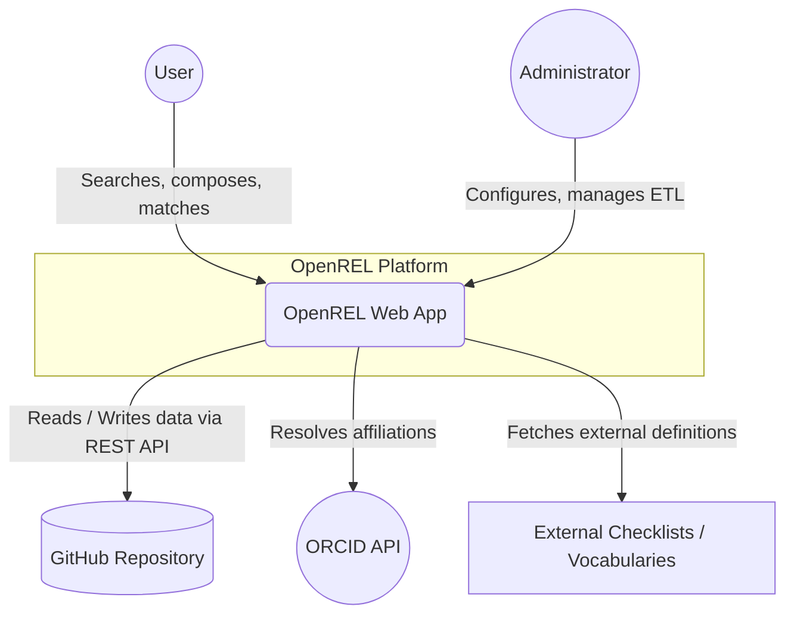
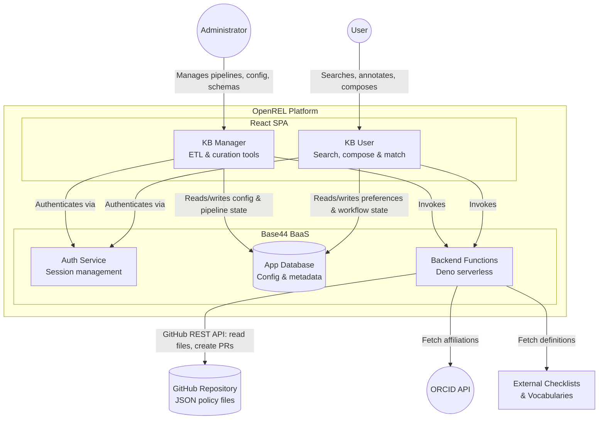

# Annex D — System Architecture

| Summary | System architecture diagrams and descriptions for the OpenREL platform using the C4 model |
| :---- | :---- |
| **Status** | Draft |
| **Version** | 0.2 |
| **Date** | 2026-06-16 |
| **Author** | W Hugo |

---

## Table of Contents
- [1. C1 — System Context](#1-c1--system-context)
- [2. C2 — Container Diagram](#2-c2--container-diagram)

---

## 1. C1 — System Context

### 1.1 Diagram

### 1.2 Description

At the C1 (System Context) level, OpenREL is viewed as a single entity interacting with several key external systems.

**Actors**
- **User:** Researchers and contributors who discover, match, and compose policies using the KB User interface.
- **Administrator:** Platform maintainers who configure global settings, define roles, and manage the knowledge base infrastructure.

**External Systems**
- **GitHub Repository:** The primary data store. OpenREL fetches JSON-based policies, actions, constraints, and vocabularies at runtime, and submits changes back via Pull Requests.
- **ORCID API:** Used for provenance and attribution. OpenREL resolves researchers' ORCID iDs to institutional affiliations and stamps every policy and workflow artefact.
- **External Checklists & Vocabularies:** OpenREL fetches external policy-related schemas (e.g. FAIR data checklists, domain-specific vocabularies) from arbitrary web sources or GitHub repositories to enrich policy analysis.

**Integration Points**
- **Runtime Data Fetching:** OpenREL avoids importing knowledge base data into its internal database. Authenticated runtime fetches from GitHub keep the knowledge base synchronised with the canonical data source.
- **Write-back via Pull Requests:** Changes made in the UI are never committed directly. The system orchestrates feature branches and Pull Requests to ensure all knowledge base updates undergo review.

---

## 2. C2 — Container Diagram

### 2.1 Diagram

### 2.2 Description

At the C2 (Container) level, the OpenREL platform is decomposed into its primary runtime units: a React single-page application (SPA) and a Base44 backend-as-a-service (BaaS) layer.

**Frontend Containers**

| Container | Role |
| :---- | :---- |
| **KB Manager** | Administrative toolset for data curators and administrators. Covers ETL pipeline management, schema validation, template authoring, vocabulary linking, and configuration of the knowledge base. |
| **KB User** | Research-facing interface for discovering, filtering, annotating, composing, and matching policies. Includes the Search, Annotate, Match, Compose, and Workflow modules. |

Both containers share a single React application shell with a role-based navigation model. Role context controls which containers and features are visible to each user.

**Backend Containers**

| Container | Role |
| :---- | :---- |
| **Auth Service** | Managed by Base44; handles user registration, login sessions, and role assignment. |
| **App Database** | Base44-hosted NoSQL store. Holds configuration records (GlobalConfig, FacetConfig, VocabularySource, ChecklistSource), workflow state (WorkflowInstance), and user metadata. It does **not** store policies — those live in GitHub. |
| **Backend Functions** | Deno-based serverless functions deployed on Base44. Act as the integration layer for GitHub (file reads, PR creation), ORCID (affiliation resolution), external vocabulary/checklist fetching, content analysis, and licence matching. |

**Key Architectural Decisions**
- **Stateless policy store:** Policies are never imported into the App Database. The knowledge base lives entirely in GitHub, and the app fetches it fresh at runtime. This ensures the UI always reflects the canonical state of the repository.
- **Pull Request governance:** All write operations to the knowledge base flow through GitHub Pull Requests via the `submitPolicyPR` backend function, enforcing a review gate before any change is published.
- **Role-based access:** The RoleContext module controls which containers, features, and workflow types are accessible. Administrators have unconditional access; all other roles are subject to configurable permission matrices.
