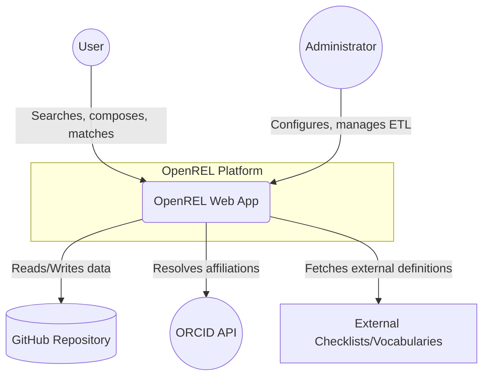

# Annex D — System Architecture (C1: System Context)

| Summary | High-level system context diagram and description for the OpenREL platform |
| :---- | :---- |
| **Status** | Draft |
| **Version** | 0.1 |
| **Date** | 2026-06-16 |
| **Author** | W Hugo |

---

## 1. C1 Diagram (System Context)

## 2. Description

At the C1 (System Context) level, OpenREL is viewed as a single entity interacting with several key external systems.

### 2.1 Actors
- **User:** Researchers and contributors who discover, match, and compose policies using the KB User interface.
- **Administrator:** Platform maintainers who configure global settings, define roles, and manage the knowledge base infrastructure.

### 2.2 External Systems
- **GitHub Repository:** The primary data store. OpenREL operates as a client that fetches JSON-based policies, actions, constraints, and vocabulary at runtime, and submits changes back via Pull Requests.
- **ORCID API:** Used for provenance and attribution. OpenREL resolves researchers' ORCID iDs to their institutional affiliations and uses these iDs to stamp every policy and workflow artefact.
- **External Checklists & Vocabularies:** OpenREL fetches external policy-related schemas (e.g., FAIR data checklists, domain-specific vocabularies) from arbitrary web sources or GitHub repositories to enrich policy analysis.

### 2.3 Integration Points
- **Runtime Data Fetching:** OpenREL avoids importing knowledge base data into its internal database. Instead, it performs authenticated runtime fetches from the GitHub repository to ensure the knowledge base is always synchronised with the canonical data source.
- **Write-back via Pull Requests:** Changes made in the UI are never committed directly. The system orchestrates feature branches and Pull Requests to ensure all knowledge base updates undergo review.
